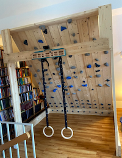

During the first lockdown all climbing gyms were closed, so I took the time to 
build a home climbing wall. 
Using a raspi and a couple of LED strips it is possible to build a 
moonboard compatible wall using open source software.

The moonboard smartphone app compatible with this led system setup using bluetooth low energy. 

The repository with source code and build descriptions
can be found [here](https://github.com/8cH9azbsFifZ/moonboard).

