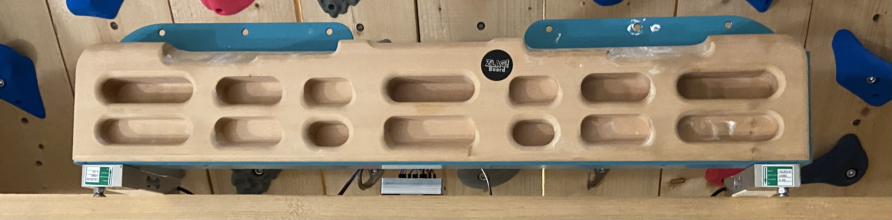

Why a universal smart hangboard?
Nowadays smart hangboards are becoming more and more popular. 
And there is a growing market for commercial products (they are expensive). 
All existing hangboard training apps have limitations (i.e. payed subscriptions, 
limited to specific hangboards, buggy, sketchy to create new or custom training plans).

This was motivation for me to learn new technologies and build an own smart 
hangboard - which is easy to reproduce for others.

Find the build instructions and sources in [this repo](https://github.com/8cH9azbsFifZ/hangboard).

