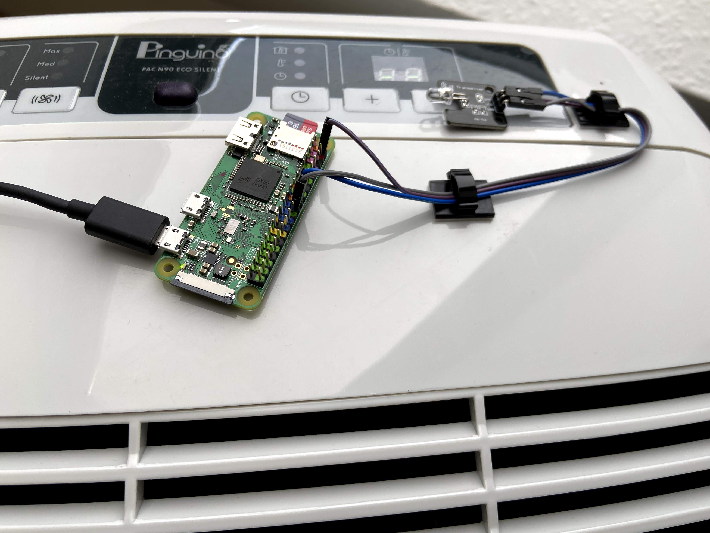

IR remote control for DeLonghi PAC AirConditioners on Raspi with MQTT support for integration in homeautomation systems (i.e. OpenHAB).

Get the source code here: [pac-n90-raspi](https://github.com/8cH9azbsFifZ/pac-n90-raspi).