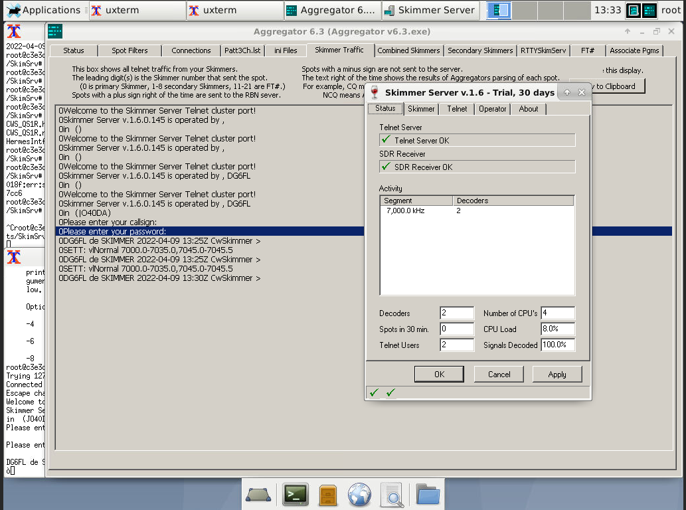
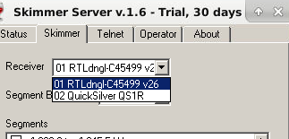

Running CW skimmer under Linux is possible using wine. Why stop there? 
Using docker and noVNC it is possible to run CW skimmer headless with HTML5 interface.
The sources can be found in [this repo](https://github.com/8cH9azbsFifZ/docker-cwskimmer).
Even RTL SDR with hermes simulation can run in docker, 
too using [this repo](https://github.com/8cH9azbsFifZ/librtlsdr).
So now we have CW skimmer and RTL SDR running in containers completely headless under Linux.

See the current spots [here](http://www.reversebeacon.net/dxsd1/dxsd1.php?f=0&c=DG6FL&t=de).

